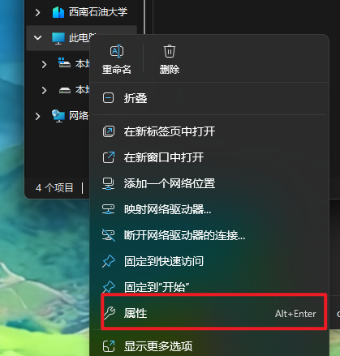
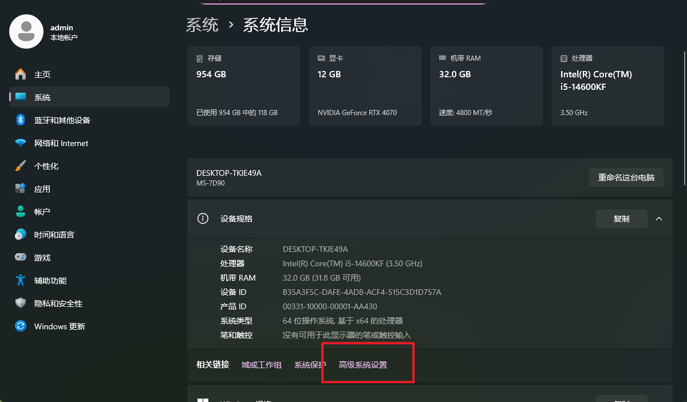
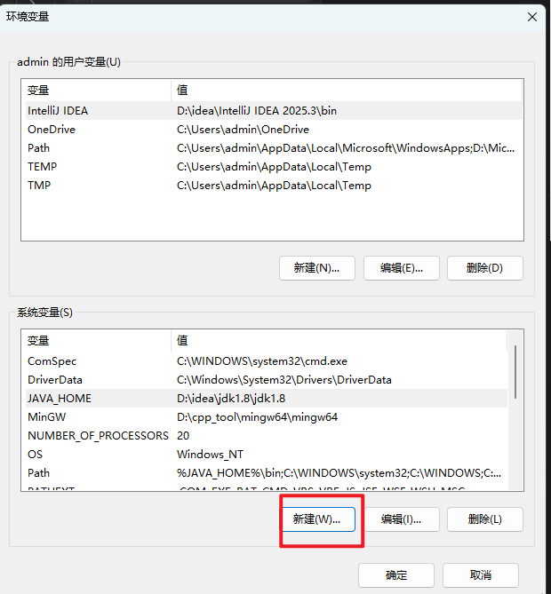
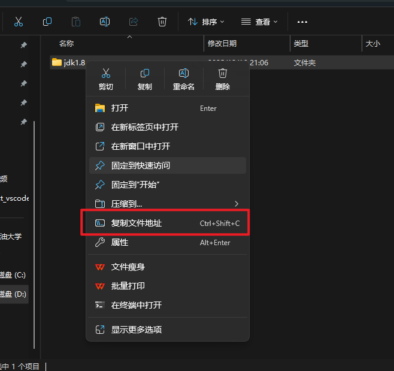
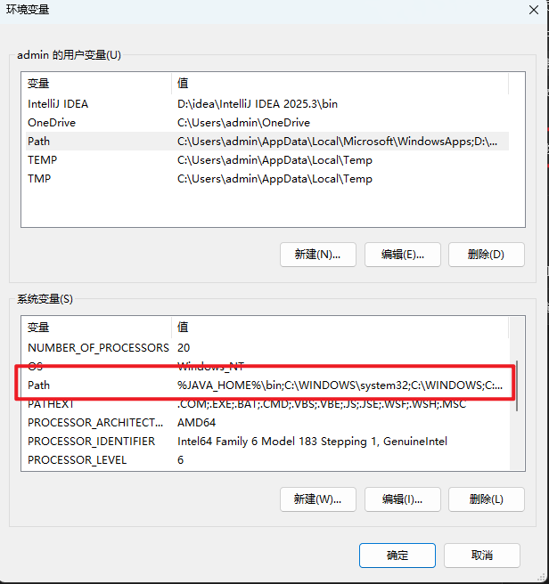
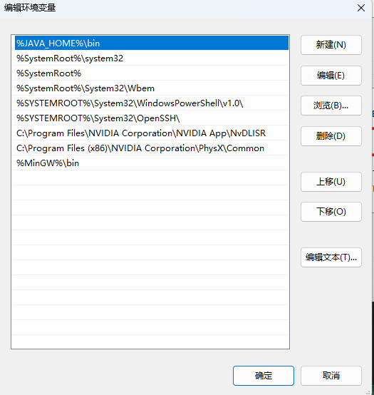
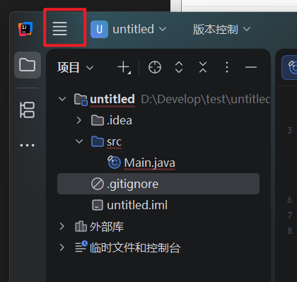
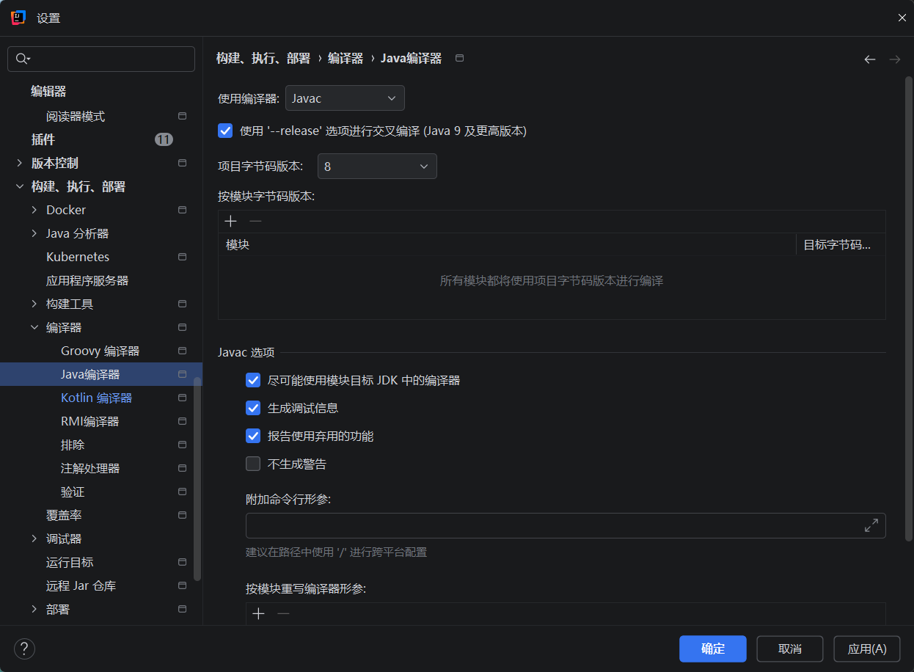
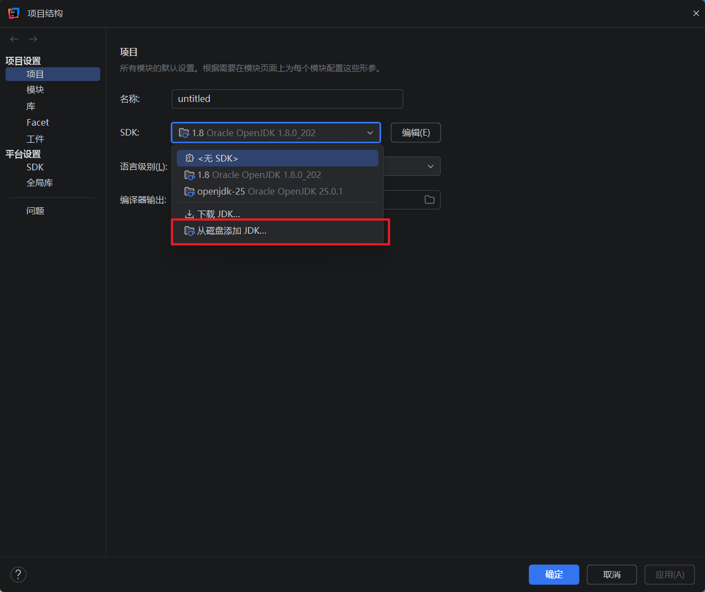

### idea下载网址：(https://www.jetbrains.com.cn/idea/download/?section=windows)
==安装流程这里不在多说==

## `JDK`file：

## 系统配置文件步骤：
##### 1-打开此电脑的属性

#### 2-点击高级系统设置

##### 3-点击环境变量

#### 4-点击新建：

#### 5-填写变量名==(全部需要大写英文)==：
比如要配置Java的环境，那我这里填写的就是  JAVA_HOME

#### 6-填写变量值:
这里需要找到压缩后的jdk文件，把文件地址进行复制后填入

#### 7-找到名为path的变量，并点击。

#### 8-新建环境变量：
==注意==： 格式需与我的示例相同，变量名按自己的来。

#### 然后挨着点击三个确定。

## idea的文件配置步骤：
#### 1-打开idea点击菜单：

#### 2-点击菜单中的设置：
点击构建-执行-部署 > 编译器 > java编译器：
按照图片进行配置，==注意需要点击应用==

### 3-点击菜单>项目结构:
==将压缩文件中的jdk添加进去==，最后点击确认即可。
这里需要注意的是每次创建项目的时候都需要添加这个jdk。
